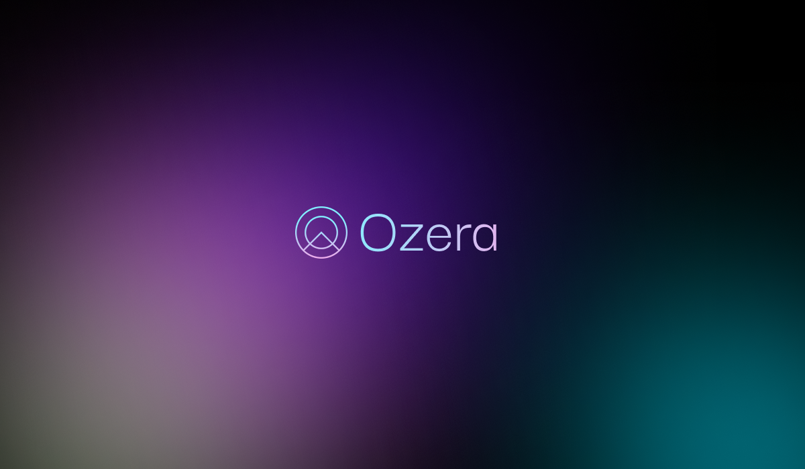

A platform offering tools for LLM researchers focused on interpretability

**Live at [ozera.app](https://ozera.app) - BETA**

## Overview

Ozera lets you run inference on language models and visualize their internals, activations, attention patterns, embeddings, and logits, layer by layer. It supports both custom-trained Ozera models and popular open-source models, with tools for activation patching, attention head analysis, and sparse autoencoder (SAE) experimentation.

## Features

- **Text Generation:** Run inference with configurable temperature, top-k, top-p, and repetition controls. Streaming supported.
- **Activation Visualization:** Layer-by-layer inspection of hidden states, attention weights, embeddings, and logits with lazy-loaded tensor retrieval.
- **Attention Analysis:** Automated head classification (induction, copying, positional), pattern mining, and cross-prompt comparison.
- **Activation Patching:** Interactive playground for swapping activations between prompts and observing the effects in real time.
- **SAE Tools:** Train sparse autoencoders on any supported model, browse learned features, view top-activating tokens, and compare feature representations across models.
- **Custom Training:** Upload datasets and train custom instances of the Ozera architecture with cost estimation upfront.
- **Credit System:** Stripe-powered credit billing for compute access across inference, training, and experiments.
- **Export:** Publication-ready figure export (PNG, PDF, SVG) with conference presets (NeurIPS, ICLR, ICML) and batch ZIP export.

## Models

### Ozera Models (built from scratch, trained on OpenWebText)

| Model | Parameters | Layers | Heads | Hidden Dim |
|-------|-----------|--------|-------|------------|
| Ozera-Nano | 12.4M | 6 | 6 | 192 |
| Ozera-Mini | 51.2M | 8 | 8 | 512 |

Each model has a corresponding sparse autoencoder trained on its activations for feature-level interpretability.

### Open-Source Models

| Model | Parameters | Family |
|-------|-----------|--------|
| SmolLM2 135M | 135M | SmolLM |
| SmolLM2 360M | 360M | SmolLM |
| SmolLM3 3B | 3B | SmolLM |
| Gemma 3 270M | 270M | Gemma |
| Gemma 3 1B | 1B | Gemma |
| Qwen3 0.6B | 600M | Qwen |
| Qwen3 1.7B | 1.7B | Qwen |
| Qwen3 4B | 4B | Qwen |

Each open-source model is also available as an instruction-tuned variant; prompts to those are wrapped in the model's chat template.

Users can also upload their own model weights, or train Ozera models on their own data.

## Project Structure

```
ozera/
├── backend/
│   ├── api/              # FastAPI routes (auth, generation, patching, SAE, etc.)
│   ├── core/
│   │   ├── transformer/  # Ozera model architecture (PyTorch)
│   │   ├── math_primitives/  # Pure math implementations of attention, activations, positional encoding
│   │   ├── open_source/  # SmolLM, Gemma, Qwen loaders
│   │   ├── sae/          # Sparse autoencoder training + analysis
│   │   ├── analysis/     # Head classification, pattern mining
│   │   ├── patching/     # Activation patching engine
│   │   ├── training/     # Training loop, optimizer, data pipeline
│   │   ├── tokenizer/    # BPE tokenizer
│   │   └── export/       # Figure generation
│   ├── inference/        # Model loading, activation store, text generation
│   ├── services/         # Modal workers, Stripe, Supabase, credit system, job orchestration
│   ├── middleware/       # Supabase auth, rate limiting
│   ├── models/           # SQLAlchemy ORM models (DB schema)
│   └── alembic/          # Database migrations
├── frontend/
    └── src/
        ├── components/   # Visualization, SAE, analysis, patching, training, auth, payments
        ├── pages/        # Unified, Training, Patching, Analysis, SAE, Settings, Auth
        ├── hooks/        # useGeneration, useModels, useTraining, useCredits, useTheme
        ├── stores/       # Auth and settings (Zustand)
        └── api/          # Axios client
```

## Deployment

- **Frontend**: Vercel
- **Backend**: Railway (Dockerized FastAPI)
- **Database**: Supabase (PostgreSQL + auth)
- **GPU Compute**: Modal (serverless T4 and A10G workers)
- **Model Storage**: Modal Volumes (weights, SAE checkpoints, datasets)